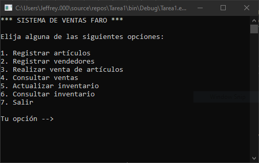

        

#  Programa de ventas de artículos

Programa que permite gestionar procesos en la venta de artículos.

## Características

* Registro, edición y consulta de artículos.
* Registro de vendedores.
* Registro  y consulta de ventas de artículos.

## Consideraciones

* Realizado con .NET Framework 4.8
* Aplicación de consola
* Visual Studio 2019
* Uso de arreglos de objetos (los artículos, vendedores y ventas tienen un número máximo establecido).

## Captura de menú principal

